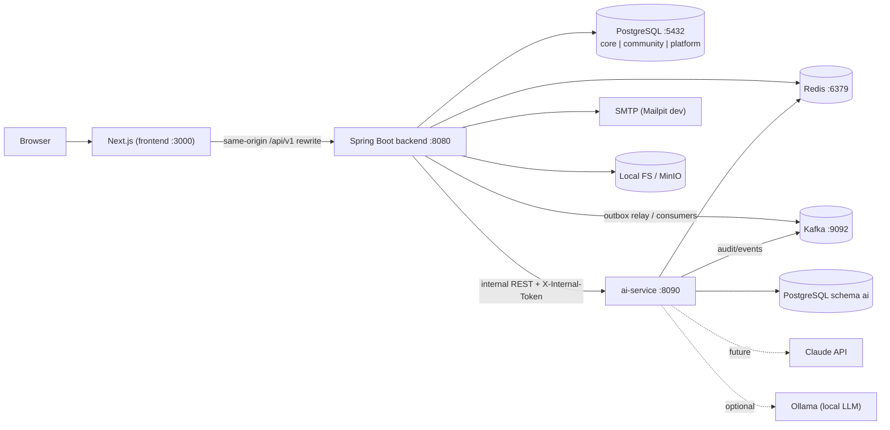

# JobForge — Architecture

> Companions: `MASTER_SPEC.md` (decisions D-xx), `API_CONTRACT.md`, `DATABASE_SCHEMA.md`.
> No application code lives in this document: it defines structure, flows, and rules.

---

## 1. Architectural Style

- **Modular monolith** (`backend/`) with strict package boundaries, plus **one** separate service (`ai-service/`).
- Why `ai-service` is separate: (a) the only holder of provider secrets (`ANTHROPIC_API_KEY`) — blast-radius isolation; (b) slow, bursty, failure-prone calls (LLM latency) must not exhaust backend threads; (c) owned by a different developer on a different release cadence; (d) independently swappable provider implementations.
- Everything else (notifications, search, community, admin) stays inside the backend until measured load or team size justifies extraction. Extraction readiness is preserved by facades + events.

## 2. System Context


`PG` and `PGAI` are the same PostgreSQL instance, different schema and DB role.

## 3. Components

| Component | Responsibility | Owner |
|---|---|---|
| `frontend` | UI for all roles, API client, auth session handling, MSW mocks | Dev 2 |
| `backend` | Public REST API, auth, domain modules, outbox relay, consumers | Dev 1 (+ Dev 3 packages) |
| `backend.ai` (gateway) | AI public endpoints, authZ, rate limit, context assembly, circuit breaker, proxy | Dev 3 |
| `backend.search` | `GET /jobs`, facets, similar jobs, community search helpers | Dev 3 |
| `backend.notification` | Event consumers, templates, preferences, SSE, email dispatcher | Dev 3 |
| `backend.platform` | Outbox, event envelope, idempotent consumer base, rate limiter, cache utilities, scheduler locks | Dev 3 |
| `ai-service` | `AIProvider`, prompts, schema validation, quality validation, quota, tracking, recommendation engine | Dev 3 |
| `infrastructure` | Compose, Postgres init, Kafka topic bootstrap, monitoring configs, Dockerfiles | Dev 3 |

## 4. Backend Modular Structure

Root package `com.jobforge.backend`. Each module is a package with a fixed layout:

```
<module>/
  api/        controllers, request/response DTOs, mappers  (HTTP edge only)
  facade/     public interface other modules may call  (e.g. JobFacade)
  app/        application services (transactions, orchestration, authorization policies)
  domain/     entities, enums, domain rules (state machines)
  infra/      repositories, external adapters
  events/     event payloads this module publishes/consumes
```

| Module | Owner | Notes |
|---|---|---|
| `shared` (kernel) | Dev 1 | `ApiResponse`, `PageMeta`, `ErrorCode`, `GlobalExceptionHandler`, `CurrentUser`, `AuditService`, validation helpers, `Clock` |
| `auth`, `user`, `profile` (seeker+recruiter), `company`, `job`, `application`, `interview`, `community`, `admin`, `audit`, `analytics`, `storage` | Dev 1 | |
| `search`, `notification`, `ai`, `platform` | Dev 3 | |

**Dependency rules (enforced by ArchUnit tests, failing CI):**
1. `api → app → domain`; `infra` implements interfaces from `app/domain`; `domain` depends on nothing but JDK + `shared`.
2. A module may call another module **only** via its `facade` package; never its `app`, `domain`, `infra`, or repositories.
3. No module touches another module's tables. Cross-module reads go through facades or events.
4. `ai` gateway reads job/company/profile data through `JobFacade`, `CompanyFacade`, `ProfileFacade`; `search` reads `jobs`/`job_skills`/`posts` through **read-only native queries inside the `search` package** (the single sanctioned exception, documented because search is a read model).
5. Controllers contain no business logic; services contain no HTTP types.
6. Entities are never returned from controllers (DTOs only).

**Facades Dev 1 must provide for Dev 3 (Phase 1–2):** `UserFacade.getSummary(id)`, `CompanyFacade.getSummary(id)/isMember(userId, companyId)`, `JobFacade.getJobForValidation(id, caller)`, `ProfileFacade.getSnapshot(userId)`, `ApplicationFacade.countByJob(jobId)`. **Facades Dev 3 provides for Dev 1:** `AiDraftFacade.verifyDraft(aiRequestId, userId)`, `OutboxPublisher.publish(event)`, `RateLimiter`, `CacheService`, `SearchIndexNotifier` (no-op in v1).

## 5. Frontend Architecture

- Next.js App Router, TypeScript `strict`, Tailwind, TanStack Query (server state), React Hook Form + Zod (forms), pnpm.
```
frontend/src/
  app/
    (public)/        landing, job search, job detail, company pages, login/register
    (seeker)/        dashboard, profile, applications, saved, recommendations, insights
    (recruiter)/     dashboard, company, jobs, pipeline, interviews, analytics, ai-studio
    (admin)/         users, recruiters, companies, jobs, reports, audit, analytics, ai-usage
    community/       feed, post detail, tag pages
  features/<domain>/ components, hooks (query/mutation), schemas (Zod), types, api calls
  lib/api/           typed fetch client, error mapping, generated OpenAPI types (`generated/`)
  lib/auth/          in-memory access token, refresh-on-401 queue, session provider
  components/ui/     design-system primitives
  mocks/             MSW handlers derived from API_CONTRACT.md
```
Rules: (1) all HTTP via `lib/api`; no `fetch` in components. (2) Server contracts typed from `docs/openapi/openapi.v1.json` (`pnpm gen:api`). (3) Zod schemas mirror API_CONTRACT §10 limits. (4) Route guards (middleware + layout) are **UX only**; the server enforces authZ. (5) Access token in memory; `401 AUTH_TOKEN_EXPIRED` → single-flight refresh → retry once. (6) Markdown rendered without raw HTML. (7) Only `NEXT_PUBLIC_*` env vars reach the browser and never hold secrets. (8) No AI SDKs or provider URLs. (9) Accessibility: keyboard, labels, axe checks in CI.
- Dev loop: MSW (`NEXT_PUBLIC_API_MOCKING=enabled`) until the real endpoint lands; switch per feature, not per project.

## 6. AI Architecture

```
AIProvider (interface)
 ├─ LocalTemplateProvider   default · deterministic, rule/template-based · no network
 ├─ OllamaProvider          optional · local open-source LLM via HTTP (OLLAMA_BASE_URL)
 └─ ClaudeProvider          future · Anthropic API · enabled only when AI_PROVIDER=claude and key present
```
- `AIProvider` contract (conceptual): `ProviderInfo info()`; `ProviderResult generate(ProviderRequest)` where a request carries `operation`, a rendered prompt/structured input, an output JSON-Schema id, limits (max tokens, timeout), and a trace id; the result carries raw text/structured payload, token counts, and provider/model ids.
- Orchestration inside `ai-service` (provider-independent):
  1. `AiRequestFilter`: verify `X-Internal-Token`, read caller identity headers.
  2. `QuotaService.reserve(user, operation)` (§17).
  3. `PromptRegistry`: versioned prompt/template per operation (files under `ai-service/src/main/resources/prompts/<operation>/v1/`). **User text is inserted only in delimited data slots**; system instructions state that data is never instructions (prompt-injection defense).
  4. `AIProvider.generate`.
  5. `OutputParser` → JSON → **JSON Schema validation** (`schemas/job-draft.v1.json`, etc.). One automatic repair retry (provider-dependent) then fail with `AI_OUTPUT_INVALID`.
  6. `ContentValidator`: business rules (length, enums, no URLs/emails/HTML, banned-term/scam patterns), `QualityScorer` (0–100 + issues).
  7. Persist `ai_requests` (validated output only), commit quota, publish audit/event.
  8. Return DTO.
- Recommendations (`LocalTemplateProvider` v1): weighted skill overlap (Jaccard + required-skill weight), title similarity (trigram/TF-IDF over provided candidate set), location/work-mode preference match, recency boost; returns `score` + human-readable `reasons`. Career insights: profile completeness rules + skill-gap computation against `marketSnapshot` supplied by backend (aggregates from `search` module). No domain DB access from ai-service.
- Contract tests: **the same suite** runs against every provider implementation; `LocalTemplateProvider` must pass 100 %; Ollama/Claude run behind a tag in CI (skipped without credentials).
- Claude enablement (later): add `ClaudeProvider` + config (`AI_PROVIDER=claude`, `ANTHROPIC_API_KEY`, `AI_MODEL`) — no controller, schema, quota, or frontend change. Model id is configuration, never hard-coded.

## 7. Generic Request Flow (backend)

Filter order: `RequestId/MDC` → `RateLimitFilter` (Redis) → `JwtAuthenticationFilter` → (Spring Security authorization rules + method security) → `IdempotencyInterceptor` (where required) → Controller → Bean Validation → Application service (`@Transactional`, ownership policy, domain rules, `AuditService`, outbox write) → DTO mapping → `ResponseEnvelopeAdvice` → client. Exceptions → `GlobalExceptionHandler` → error envelope.

## 8. Authentication Flow

1. **Register:** validate → create `users` (`PENDING_VERIFICATION`, BCrypt 12) + role profile row → `VerificationToken` → outbox `UserRegistered` + `EmailVerificationRequested` → email (Mailpit in dev).
2. **Verify email:** token hash lookup, single use, 24 h TTL → `ACTIVE`.
3. **Login:** rate limit (IP+email) and Redis lockout (5 failures → 15 min) → verify password → status checks → issue access JWT (15 min, claims in API_CONTRACT §3) + create refresh token (opaque 256-bit, stored as SHA-256) → set `jf_refresh` cookie → audit `USER_LOGIN_SUCCESS/FAILED`.
4. **Authenticated call:** JWT signature/exp → load minimal principal (id, role, `ver`) → compare `ver` with `users.token_version` (cached in Redis `jf:{env}:auth:tv:{userId}`, TTL 60 s) → reject on mismatch/suspension.
5. **Refresh:** cookie + `X-Requested-With` → find by hash → if revoked/rotated ⇒ revoke family, audit `TOKEN_REUSE_DETECTED`, 401 → else rotate (new token, `replaced_by_id`) → new access token.
6. **Logout / password change / admin force-logout / suspension:** revoke refresh family (or all), bump `token_version` when all sessions must die.

## 9. Authorization (RBAC) Architecture

Three layers, all required: (1) URL rules in `SecurityConfig` (coarse: `/admin/**` → ADMIN, etc.); (2) method-level `@PreAuthorize` with role expressions; (3) **ownership/tenant policies** in services (e.g. `JobPolicy.canManage(user, job)` = member of `job.company`). Not-visible resources return **404**, not 403.

| Capability | SEEKER | RECRUITER | ADMIN |
|---|---|---|---|
| Browse/search published jobs, companies | ✅ | ✅ | ✅ |
| Own profile/skills/resumes | ✅ own | — | read via admin tools |
| Apply / withdraw / track | ✅ own | — | read |
| Create/edit/publish jobs | — | ✅ company members (approved + verified for publish) | remove/restore only |
| View applicants / candidate profile | — | ✅ only for company's jobs/applicants | ✅ (audited) |
| Move application status / notes / rating | — | ✅ company | — |
| Schedule interviews | respond only | ✅ | read |
| AI Job Studio (`job-drafts`, `job-validations`) | — | ✅ approved | ✅ |
| AI recommendations / insights | ✅ | candidates only | — |
| Community posting/interaction | ✅ | ✅ | ✅ + moderate |
| Reports: file | ✅ | ✅ | ✅ |
| User/recruiter/company/job/report/audit/AI admin | — | — | ✅ |

Mandatory tests per endpoint: anonymous → 401; wrong role → 403; right role, wrong owner → 404/403 (IDOR test); suspended user → 403.

## 10. Job Creation Flow

1. Recruiter (APPROVED) opens AI Job Studio **or** the manual form.
2. *(optional)* AI draft per §12 returns `requestId` + draft; recruiter edits.
3. `POST /jobs` → validate DTO → verify caller is company member → if `aiRequestId`: `AiDraftFacade.verifyDraft` → persist `jobs` (`DRAFT`) + `job_skills` (skills resolved/created in catalog as unverified) → audit `JOB_CREATED` → outbox `JobCreated` (internal only).
4. `POST /jobs/{id}/publish` → check `RECRUITER_APPROVED` + `COMPANY_VERIFIED` → run validator (call ai-service `job-validations` when available; fall back to local rule validator in backend if ai-service down — publishing must not depend on AI availability) → set `PUBLISHED`, `published_at`, default `expires_at` → audit `JOB_PUBLISHED` → outbox `JobPublished` → search cache invalidation (`jf:{env}:search:*` version bump) → notifications (followers of company).
5. Expiry scheduler (ShedLock) moves `PUBLISHED` past `expires_at` to `EXPIRED`, emits `JobExpired`; `JOB_EXPIRING_SOON` 3 days prior.

## 11. Application Flow

1. Seeker `POST /jobs/{jobId}/applications` with `Idempotency-Key`.
2. Checks: job `PUBLISHED` & not expired; resume belongs to seeker; profile minimum (headline + ≥1 skill) else 422; unique per (job, seeker).
3. Transaction: insert `applications` with `profile_snapshot`; insert status history (`null→SUBMITTED`); audit `APPLICATION_SUBMITTED`; outbox `ApplicationSubmitted`.
4. Consumers: notification module → recruiter(s) `APPLICATION_RECEIVED`, seeker `APPLICATION_SUBMITTED` (in-app + email by preference); analytics counter `applications` in Redis.
5. Recruiter `PATCH /applications/{id}/status` → transition matrix (DATABASE_SCHEMA §3.6) → history row, audit, outbox `ApplicationStatusChanged` → seeker notified. Optimistic lock via `If-Match`.
6. Seeker `withdraw` → `WITHDRAWN` (terminal).

## 12. AI Generation Flow

```mermaid
sequenceDiagram
  participant FE as Frontend
  participant BE as Backend (ai gateway)
  participant AI as ai-service
  participant R as Redis
  participant DB as PG (schema ai)
  FE->>BE: POST /api/v1/ai/job-drafts (JWT, Idempotency-Key)
  BE->>BE: authN, role=RECRUITER+approved, validate DTO
  BE->>R: rate limit (AI class)
  BE->>BE: assemble context (company summary) via facades
  BE->>AI: POST /internal/v1/ai/job-drafts (X-Internal-Token, X-User-Id, X-User-Role)
  AI->>R: quota reserve (atomic)
  AI->>DB: insert ai_requests (PENDING) + ledger RESERVED
  AI->>AI: provider.generate → parse → JSON Schema → business validation → quality score
  AI->>DB: update ai_requests SUCCEEDED + output; ledger COMMITTED
  AI-->>Kafka: AiRequestCompleted + audit
  AI-->>BE: draft + quality + quota
  BE-->>FE: 200 envelope
```
Failure paths: quota exceeded → ledger not created, `ai_requests` `REJECTED_QUOTA`, 429; schema failure after retry → `REJECTED_VALIDATION`, release reservation, 502; provider timeout/error → `FAILED`, release reservation, 503/504. Idempotent replay returns the stored output without charging again.

## 13. Notification Flow

Domain event (Kafka) → `NotificationConsumer` (idempotent via `processed_events`) → resolve recipients + preferences → build content from templates (`notification/templates/<type>`; i18n-ready) → insert `platform.notifications` (dedupe key e.g. `APP_STATUS:{appId}:{status}`) → publish to Redis channel `jf:{env}:notif:{userId}` → SSE endpoint pushes `notification` event to connected tabs → if email enabled insert `email_outbox` → `EmailDispatcher` (scheduled, ShedLock, exponential backoff, max 5 attempts) sends via SMTP. Frontend uses SSE + TanStack Query invalidation of `unread-count`, falling back to polling every 60 s if SSE fails.

## 14. Async Processing and Kafka

- **Broker:** Apache Kafka KRaft, single broker locally (`KAFKA_BOOTSTRAP_SERVERS`). Topics created by `infrastructure/kafka/create-topics.sh` (idempotent): partitions 3 (dev 1), RF 1 (dev).
- **Topics:** `jobforge.users.v1`, `jobforge.jobs.v1`, `jobforge.applications.v1`, `jobforge.interviews.v1`, `jobforge.community.v1`, `jobforge.moderation.v1`, `jobforge.ai.v1`, `jobforge.audit.v1`, and `<topic>.dlq`.
- **Envelope (all events):**
```json
{ "eventId": "uuid", "eventType": "ApplicationStatusChanged", "eventVersion": 1,
  "occurredAt": "…Z", "producer": "backend|ai-service", "actor": { "userId": "uuid", "role": "RECRUITER" },
  "aggregateType": "Application", "aggregateId": "uuid", "traceId": "…", "payload": { } }
```
- **Key** = `aggregateId` (ordering per aggregate). **Delivery:** at-least-once; consumers idempotent.
- **Transactional outbox:** producers insert into `platform.outbox_events` in the business transaction; `OutboxRelay` (scheduled, ShedLock, batch 100) publishes and sets `published_at`. Services call `OutboxPublisher.publish(...)` and never use `KafkaTemplate` directly.
- **Consumer rules:** consumer group per module (`jobforge-notification`, `jobforge-audit`, `jobforge-search`); retry 3× with backoff, then DLQ with error header; payload schema evolution additive only; new fields optional.
- **Event catalog (v1):**

| Event | Topic | Producer | Consumers |
|---|---|---|---|
| UserRegistered, EmailVerificationRequested, PasswordResetRequested, UserStatusChanged | users | backend/auth | notification, audit |
| RecruiterApproved/Rejected, CompanyVerified/Rejected | users | backend | notification |
| JobPublished, JobUnpublished, JobClosed, JobExpired, JobRemoved, JobUpdated | jobs | backend/job | notification, search (cache), analytics |
| ApplicationSubmitted, ApplicationStatusChanged, ApplicationWithdrawn | applications | backend | notification, analytics |
| InterviewScheduled/Updated/Cancelled/Responded | interviews | backend | notification |
| PostCreated, CommentCreated, PostLiked, UserMentioned, UserFollowed | community | backend | notification, search (cache) |
| ContentReported | moderation | backend/report | none in v1 (audit is written synchronously as `REPORT_FILED`; no notification is defined) |
| ContentModerated | moderation | backend/report | notification (`CONTENT_MODERATED` to the affected owner; audit is written synchronously as `CONTENT_MODERATED`) |
| AiRequestCompleted, AiQuotaLow | ai | ai-service | notification, audit |
| AuditRecorded | audit | ai-service | backend audit consumer |

- **Not async (must stay synchronous):** auth, validation, authorization, the primary business transaction, audit for security-critical backend actions.
- **Report events:** `ContentReported` is emitted for later processing only; it does not guarantee a user-facing notification. Admin report-arrival notifications need a separate approved contract change (new notification type and recipient policy).
- **Kafka-down behavior:** backend keeps working (outbox accumulates); notifications are delayed, not lost.

## 15. Redis Responsibilities

Redis is a cache/coordination layer only; every key has a TTL and is reconstructable. Key pattern `jf:{env}:{domain}:{...}`.

| Domain | Key examples | TTL | Owner |
|---|---|---|---|
| Rate limit | `rl:{class}:{userId|ip}` (token bucket via Bucket4j-Redis) | window | D3 |
| Login lockout | `auth:fail:{email-hash}` | 15 min | D1 |
| Token version cache | `auth:tv:{userId}` | 60 s | D1 |
| Idempotency | `idem:{userId}:{key}` (stores status+body hash+response) | 24 h | D3 |
| AI quota counters | `ai:quota:{userId}:{yyyyMMdd}` (Lua atomic reserve/commit/release) | to end of period+1 d | D3 |
| Cache | `cache:job:{id}`, `cache:skills:{prefix}`, `cache:facets:{hash}:{ver}`, `cache:feed:{hash}`, `cache:ai:rec:{userId}`, `cache:ai:insight:{userId}` | 1–15 min (insight 6 h) | owners |
| Pub/Sub | `notif:{userId}` | n/a | D3 |
| Counters | `stats:jobview:{jobId}:{yyyyMMdd}` flushed to `job_daily_stats` | 3 d | D1 |
| Scheduler locks | ShedLock (JDBC table in `platform`) | n/a | D3 |

Cache invalidation: write path bumps a namespace version (`cache:search:ver`) instead of key scans. Redis outage ⇒ fail-open for caches, **fail-closed for AI quota and auth lockout counters falling back to ledger/DB** (documented degraded mode), rate limiter falls back to an in-memory per-instance bucket.

## 16. Search Architecture

- v1: PostgreSQL FTS on `jobs.search_vector` (title weight A, description C) + `pg_trgm` fuzzy on title/company name for typo tolerance; filters via indexed columns; ranking = `ts_rank_cd` + recency decay + exact-title boost; `skills` AND filter via `job_skills`; facets (workMode, employmentType, experienceLevel, top locations, top skills) via grouped counts, cached 60 s keyed by filter hash + namespace version.
- `SearchProvider` interface (`searchJobs`, `facets`, `similar`) implemented by `PostgresSearchProvider`. A future `OpenSearchProvider` consumes `jobforge.jobs.v1` events to index; the REST contract does not change.
- Performance budget: p95 < 300 ms at 10k published jobs; mandatory `EXPLAIN` review for new filters.
- Security: only `PUBLISHED`, non-deleted, non-expired jobs ever appear; query input is parameterized and `websearch_to_tsquery` is used (no raw tsquery syntax from users).
- Community search: same pattern on `posts.search_vector` (owned by D1, using D3's `SearchProvider` helpers).

## 17. AI Quota and Rate Limiting

- **Rate limit** (requests/min) — backend edge (`AI` class) **and** ai-service (defense in depth).
- **Quota** (credits/period) — enforced **only** in ai-service, atomically:
  1. Resolve effective limit: user override (unexpired) else role policy.
  2. Redis Lua: if `used + reserved + cost > limit` → reject `AI_QUOTA_EXCEEDED`; else increment `reserved`.
  3. Insert ledger `RESERVED` (DB is source of truth).
  4. On success: ledger `COMMITTED`, Redis moves reserved→used. On failure/timeout: `RELEASED`, Redis decrement. Stale `RESERVED` (>2 min) auto-released by a ShedLock sweeper.
  5. Redis loss: rebuild counters from ledger on demand.
- Low-quota event at 80 % → `AiQuotaLow` notification (once per period).
- Cached recommendation/insight hits cost 0 credits. Failed requests cost 0.

## 18. Audit Logging

`AuditService.record(action, entityType, entityId, before, after, metadata)` writes to `core.audit_logs` in the caller's transaction with actor/ip/user-agent/requestId taken from request context (`AuditContext`). Redaction utility strips password/token/secret keys. ai-service emits `AuditRecorded` events; backend `AuditConsumer` persists them (`source=AI_SERVICE`). `ai_requests` is additionally the AI-specific system of record. Required actions: DATABASE_SCHEMA §13. Table is append-only (trigger + privileges). Admin viewer: `GET /admin/audit-logs`.

## 19. Security Architecture

**Checklist (Phase 6 gate; each item has an owner and a test or CI check):**
- Transport: TLS at edge (Caddy/nginx in prod); HSTS; secure cookies.
- Headers (Next.js + backend): CSP (no inline scripts, `connect-src 'self'`), `X-Content-Type-Options`, `Referrer-Policy`, `Permissions-Policy`, `frame-ancestors 'none'`.
- Authn: BCrypt(12); generic login errors; lockout; email verification; refresh rotation/reuse detection; short access TTL.
- Authz: three layers (§9); IDOR tests; admin endpoints audited.
- Input: Bean Validation + Zod; request size limits (1 MB JSON, 5 MB upload); strict JSON (unknown fields rejected); parameterized queries only (no string-built SQL); Markdown HTML-stripped server side; sanitized rendering client side.
- Uploads: MIME + magic-byte validation, random storage keys, never served inline from the app origin, download via authorized endpoint; optional ClamAV compose profile.
- CSRF: refresh cookie `SameSite=Strict` + custom header; all other endpoints use bearer tokens (no cookie auth ⇒ no CSRF surface).
- CORS: same-origin in prod; dev allowlist via `CORS_ALLOWED_ORIGINS`.
- Secrets: env only; `.env` git-ignored; `.env.example` has placeholders; gitleaks pre-commit + CI; AI key exists only in ai-service runtime env.
- Service auth: backend→ai-service via `X-Internal-Token` (≥32 bytes, rotated), ai-service not published on host ports outside dev, no user JWT forwarded.
- AI-specific: schema validation before persistence; prompt-injection guard (data slots, instruction hierarchy); output PII/URL stripping; quota + rate limit; audit; no raw provider errors to clients.
- Data: least-privilege DB roles; audit log immutability; PII excluded from logs (masking filter); retention jobs.
- Supply chain: Dependabot, Trivy (fs + images), CodeQL (if public), `mvn dependency-check` weekly, `pnpm audit` in CI.
- Abuse: rate limits, report flow, spam heuristics on community posts (link count, duplicate body hash), per-user post limits.

## 20. Error Handling and Validation Strategy

- **One** `GlobalExceptionHandler` (kernel) maps: `ValidationException`/`MethodArgumentNotValidException` → 400 `VALIDATION_FAILED` (+details); `AccessDeniedException` → 403; `ResourceNotFoundException` → 404; `ConflictException` family → 409; `BusinessRuleException` → 422; `RateLimitedException` → 429; `AiException` subclasses → 4xx/5xx per catalog; anything else → 500 `INTERNAL_ERROR` with logged stack trace and `requestId`. New codes only via contract change.
- Services throw typed domain exceptions carrying an `ErrorCode`; they never return error DTOs.
- Frontend maps `error.code` → localized message; `details[].field` → form errors via RHF `setError`.
- Validation layers: (1) client Zod; (2) DTO Bean Validation (`@Valid`, limits from API_CONTRACT §10); (3) service-level domain invariants and state machines; (4) DB constraints as final guard; (5) AI output: schema → business rules → sanitization.

## 21. Docker and Local Development

### 21.1 Compose layout (`docker-compose.yml` at repo root; configs in `infrastructure/`)

| Service | Image/build | Host port | Profile |
|---|---|---|---|
| postgres | `postgres:16` | 5432 | default |
| redis | `redis:7-alpine` | 6379 | default |
| kafka | `apache/kafka` (KRaft) | 9092 | default |
| kafka-init | one-shot topic creation | — | default |
| mailpit | `axllent/mailpit` | 1025 SMTP, 8025 UI | default |
| minio | `minio/minio` | 9000 / 9001 | `storage` |
| kafka-ui | `provectuslabs/kafka-ui` | 8081 | `tools` |
| backend | build `backend/` | 8080 | `app` |
| ai-service | build `ai-service/` | 8090 (dev only) | `app` |
| frontend | build `frontend/` | 3000 | `app` |
| prometheus / grafana / loki+promtail | official images | 9090 / 3001 / 3100 | `monitoring` |
| ollama | `ollama/ollama` | 11434 | `ollama` |
| clamav | `clamav/clamav` | — | `security` |

- All services have healthchecks; `depends_on: condition: service_healthy`. Named volumes for Postgres/Kafka/MinIO. One network `jobforge-net`; only `frontend` (and in dev, backend/ai for debugging) publish ports.
- **Daily loop:** `docker compose up -d` (infra only) → run backend (`mvn spring-boot:run`), ai-service, frontend (`pnpm dev`) natively with hot reload. **Integration loop:** `docker compose --profile app up --build`. **Full:** add `--profile monitoring --profile tools`.
- Multi-stage, non-root Dockerfiles (`eclipse-temurin:21-jre` for Java, `node:22-alpine` for Next.js standalone output); health endpoints `/actuator/health/readiness` and `/api/health` (frontend).
- Helper scripts in `infrastructure/scripts/`: `dev-up.sh`, `dev-reset.sh` (drops volumes), `seed-dev.sh`, `gen-secrets.sh` (generates local `.env` with random secrets).
- Dev prerequisites: JDK 21, Maven 3.9, Node 22 + pnpm, Docker. Memory budget fits 8 GB RAM laptops (default profile ≈ 1.5 GB).

## 22. CI/CD

GitHub Actions (free tier), path-filtered so each developer's lane only runs its own jobs:

| Workflow | Trigger | Steps |
|---|---|---|
| `backend-ci.yml` | PR/push touching `backend/**`, `docs/openapi/**` | JDK 21, `mvn -B verify` (unit + Testcontainers ITs + ArchUnit), Spotless/Checkstyle, JaCoCo gate, regenerate OpenAPI and **fail if it differs from `docs/openapi/openapi.v1.json`** |
| `ai-ci.yml` | `ai-service/**` | `mvn verify`, provider contract tests (local), schema golden tests, coverage gate |
| `frontend-ci.yml` | `frontend/**`, `docs/openapi/**` | pnpm install --frozen-lockfile, lint, `tsc --noEmit`, Vitest, regenerate API types and fail on diff, `next build`, grep guard: no `ANTHROPIC`/`api.anthropic.com` in `frontend/` |
| `infra-ci.yml` | `infrastructure/**`, `docker-compose.yml`, Dockerfiles | `docker compose config`, hadolint, shellcheck, build images |
| `security.yml` | PR + weekly | gitleaks, Trivy fs, CodeQL (public repos), dependency review |
| `integration.yml` | PR to `main`, nightly | `docker compose --profile app up --build --wait`, API smoke (auth→job→apply→AI draft with local provider), Playwright e2e smoke |
| `release.yml` | tag `v*` | Build and push images to GHCR, attach SBOM, create release notes |

Required checks: all path-relevant workflows green + `security.yml`. CD (later): deploy workflow pulling GHCR images to a VM via SSH + `docker compose pull && up -d` (staging automatic from `main`, prod manual approval).

## 23. Testing Strategy

| Layer | Tools | Rule |
|---|---|---|
| Backend unit | JUnit 5, Mockito, AssertJ | Domain rules, state machines, policies |
| Backend integration | Spring Boot Test + **Testcontainers** (Postgres, Redis, Kafka) | Every endpoint: happy path, validation, 401/403/404 (IDOR), conflict; repositories with real PG; Flyway from empty DB |
| Architecture | ArchUnit | Module/dependency rules (§4) |
| Contract | OpenAPI snapshot diff; response-shape tests against API_CONTRACT examples | Fails CI on drift |
| ai-service | JUnit, JSON-schema golden files | Provider contract suite; schema failures; quota concurrency tests (parallel reserve); prompt-injection fixtures |
| Frontend unit/component | Vitest, React Testing Library, MSW | Forms, hooks, error mapping |
| E2E | Playwright against compose `app` profile | Seeker apply flow, recruiter pipeline, AI draft→publish, admin moderation |
| Accessibility | axe-core in Playwright | No critical violations |
| Performance | k6 (free) scripts in `infrastructure/perf/` | Search p95 target, AI endpoint rate-limit behavior (Phase 6) |
| Security | Authorization matrix tests, dependency scans, ZAP baseline (Phase 6) | |

Test data: builders/factories per module; dev seed separate from test fixtures. Flaky tests are fixed or quarantined within 48 h.

## 24. Git Workflow

- Branches: `main` (releasable, tagged), `develop` (integration), lane branches `feature/backend` (Dev 1), `feature/frontend` (Dev 2), `feature/ai` and `feature/infra` (Dev 3). Git cannot nest refs under an existing branch name, so topic work happens **on the lane branch** or on flat names such as `feature/backend-job-publish` (never `feature/backend/...`).
- **Daily integration rule:** each developer merges `develop` into their lane at the start of the day and opens a PR lane → `develop` at least daily (or per vertical slice). PRs ≤ ~400 changed lines where feasible.
- **Merge method:** lane → `develop` uses **merge commit** (not squash) so lanes don't diverge; `develop` → `main` is a release PR (merge commit) after `integration.yml` is green; tag `vMAJOR.MINOR.PATCH`.
- Reviews: one approval from a **different** developer; contract/shared-file PRs need owner + Dev 2. `.github/CODEOWNERS` maps paths to owners (§25).
- Commits: Conventional Commits with scope = module, referencing feature IDs: `feat(job): publish validation (RC-2)`.
- No force-push to `main`/`develop`. No direct commits to them. If branch protection isn't available on the plan, treat as policy and review in PRs.
- PR template checklist: contract updated? migration added? tests added (incl. authz)? OpenAPI snapshot regenerated? `.env.example` updated? docs/status updated?

## 25. Ownership, Shared Files, and Risk Register

### 25.1 CODEOWNERS (to place in `.github/CODEOWNERS`)
```
/backend/                                   @dev1
/backend/src/main/java/com/jobforge/backend/ai/            @dev3
/backend/src/main/java/com/jobforge/backend/search/        @dev3
/backend/src/main/java/com/jobforge/backend/notification/  @dev3
/backend/src/main/java/com/jobforge/backend/platform/      @dev3
/backend/src/main/resources/db/migration/platform/         @dev3
/frontend/                                  @dev2
/ai-service/                                @dev3
/infrastructure/ /docker-compose.yml /.github/workflows/   @dev3
/docs/API_CONTRACT.md /docs/DATABASE_SCHEMA.md /docs/ARCHITECTURE.md /docs/MASTER_SPEC.md /CLAUDE.md   @dev1 @dev2 @dev3
```

### 25.2 Ambiguities found in the brief and how they were resolved

| Ambiguity | Resolution |
|---|---|
| Who owns Community backend? | Dev 1 (D-14); heavy → scheduled Phase 4; Dev 3 supports feed cache/search/notifications |
| Who owns notification **endpoints** vs infra? | Dev 3 owns both (module `notification`) |
| Who owns `GET /jobs` search vs jobs CRUD? | Search = Dev 3; CRUD = Dev 1; shared index/column spec lives in DATABASE_SCHEMA §4.4/§9 |
| Who owns AI endpoints (frontend sees backend only)? | Backend `ai` gateway, Dev 3 (D-03) |
| Is ai-service a separate service? What language? | Yes; Java 21 (D-01/D-02) |
| Where are quota and audit stored? | Quota in `ai` schema (ledger); audit centrally in `core.audit_logs` (ai-service emits events) |
| Dev 3 owns 3+ lanes (AI, infra, search/notifications) | Added `feature/infra`; Dev 3 workload flagged in §25.4; Phase 0 infra delivered first |
| Resume/file storage owner and tech | Dev 1 (`storage` module, `FileStorage` interface); Dev 3 provides MinIO profile |
| Recruiter approval/company verification | Added D-16 and admin endpoints |
| Analytics (recruiter/admin) owner | Dev 1 (SQL aggregates + Redis counters) |

### 25.3 Shared files and likely merge-conflict hotspots

| File | Risk | Mitigation |
|---|---|---|
| `docs/API_CONTRACT.md`, `DATABASE_SCHEMA.md` | All three edit | Contract PRs only, docs-only, merge first, section ownership, tiny diffs |
| `docs/openapi/openapi.v1.json` | Generated, large diffs | Only backend CI/Dev 1 regenerates; others never hand-edit; stable key ordering |
| `.env.example`, `docker-compose.yml` | Frequent additive edits | Group by service with comment banners; additive only; Dev 3 merges |
| `application.yml` | Shared config | Split into `application.yml` (kernel) + `application-<module>.yml` imported via `spring.config.import`; each module has its own `@ConfigurationProperties` prefix |
| `SecurityConfig`, `shared/**` | Dev 3 needs rules for `/ai/**`, `/notifications/**` | Dev 1 defines URL rule registry hooked by `SecurityRulesContributor` beans; Dev 3 adds own contributor in own package |
| `GlobalExceptionHandler` / `ErrorCode` enum | Both add codes | Codes only via contract change; `AiErrorCode` extension in `ai` package mapped by contributor |
| Backend `pom.xml` | Dev 3 needs libs (Bucket4j, Kafka, ShedLock, Resilience4j) | Dev 3 adds dependencies in a dedicated PR to `develop` first; BOM-managed versions |
| Flyway migrations | Version collisions | Timestamp versions + per-schema directories + per-schema history |
| `frontend/pnpm-lock.yaml` | Only Dev 2 touches | Others never install JS deps |
| `CLAUDE.md`, `README.md` | Edits drift | Unanimous PR for CLAUDE.md; README by Dev 3 |

### 25.4 Integration risks

1. **Contract drift** (Dev 2 builds against stale shapes) → OpenAPI diff gate, MSW parity, contract changelog.
2. **AI gateway ↔ job module coupling** (`aiRequestId` verification, context facades) → facades specified in §4 and delivered in Phase 1–2 before Phase 3.
3. **Event schema mismatch** between producers (Dev 1) and consumers (Dev 3) → event catalog in §14 is a contract; payload classes live in the producer's `events/` package and are read-only to consumers.
4. **Dev 3 overload** (AI + infra + search + notifications + CI) → Phase 0 infra first; defer OpenSearch/monitoring dashboards; Dev 1 may take over `search` module if Phase 2 slips (documented REQ file).
5. **Dev 1 overload** (largest backend surface) → Community is Phase 4; admin/analytics in Phase 5; use code generation for CRUD boilerplate sparingly and consistently.
6. **Security regression via IDOR** → mandatory authorization negative tests, CI-enforced test naming (`*AuthorizationIT`).
7. **Free-tier Claude context limits** → small slices, numbered docs, Session Bootstrap in CLAUDE.md.
8. **Docker memory on dev machines** → default profile infra-only; optional profiles.

## 26. Integration Workflow

1. **Phase kickoff:** contract PR (endpoints, DTOs, tables, events) merged to `develop`; status files updated.
2. **Parallel build:** Dev 1 implements endpoints → regenerates OpenAPI; Dev 2 builds UI on MSW mocks from the contract; Dev 3 builds provider/search/notification against facades and stubbed backend data.
3. **Slice integration:** when a Dev 1/3 endpoint is merged to `develop`, Dev 2 flips that feature from MSW to the real API and fixes drift via a contract PR if needed.
4. **Weekly integration day:** all lanes merged to `develop`; run `integration.yml`; fix breakages; release PR to `main` when green.
5. **Communication artifacts (no shared chat needed):** `docs/status/<lane>.md` (what's done, in progress, blocked — each lane edits only its own file), `docs/requests/REQ-*.md` (cross-lane asks, one file each), `docs/CHANGELOG_CONTRACTS.md` (append-only), ADRs in `docs/adr/`.
6. **Definition of Done:** code + tests (incl. authz) + contract/docs updated + OpenAPI snapshot + `.env.example` + CI green + reviewed by another developer + status file updated.

## 27. Environment Configuration

Twelve-factor: all config via env vars; `application.yml` holds defaults only for local dev. Profiles: `dev`, `test`, `staging`, `prod`. `.env.example` is the index of every variable.

| Variable | Service | Dev default | Secret |
|---|---|---|---|
| `SPRING_PROFILES_ACTIVE` | backend, ai | `dev` | no |
| `DB_URL` / `DB_USER` / `DB_PASSWORD` | backend (role `jobforge_backend`) | `jdbc:postgresql://localhost:5432/jobforge` | yes |
| `AI_DB_URL` / `AI_DB_USER` / `AI_DB_PASSWORD` | ai-service (role `jobforge_ai`) | same DB | yes |
| `DB_MIGRATION_USER` / `DB_MIGRATION_PASSWORD` | backend, ai (owner role) | | yes |
| `REDIS_HOST` / `REDIS_PORT` / `REDIS_PASSWORD` | backend, ai | `localhost` / `6379` / empty | yes |
| `KAFKA_BOOTSTRAP_SERVERS` | backend, ai | `localhost:9092` | no |
| `JWT_SECRET` (≥32 bytes) / `JWT_ACCESS_TTL_MINUTES` / `JWT_REFRESH_TTL_DAYS` | backend | generated / `15` / `14` | secret |
| `COOKIE_SECURE` / `COOKIE_DOMAIN` | backend | `false` (dev) / empty | no |
| `CORS_ALLOWED_ORIGINS` | backend | `http://localhost:3000` | no |
| `APP_BASE_URL` | backend | `http://localhost:3000` | no |
| `MAIL_HOST` / `MAIL_PORT` / `MAIL_USER` / `MAIL_PASSWORD` / `MAIL_FROM` | backend | `localhost`/`1025`/—/—/`no-reply@jobforge.local` | password yes |
| `STORAGE_PROVIDER` (`local|s3`) / `STORAGE_LOCAL_PATH` / `S3_ENDPOINT` / `S3_BUCKET` / `S3_ACCESS_KEY` / `S3_SECRET_KEY` | backend | `local` / `./data/uploads` | keys yes |
| `AI_SERVICE_URL` / `AI_INTERNAL_TOKEN` | backend (client), ai (server) | `http://localhost:8090` / generated | token yes |
| `AI_PROVIDER` (`local|ollama|claude`) / `AI_MODEL` | ai | `local` / `template-v1` | no |
| `OLLAMA_BASE_URL` | ai | `http://localhost:11434` | no |
| `ANTHROPIC_API_KEY` | **ai-service only, prod/staging** | unset | yes |
| `AI_QUOTA_ENABLED` / `RATE_LIMIT_ENABLED` | backend, ai | `true` | no |
| `SEED_DEV_DATA` / `DEV_SEED_PASSWORD` | backend | `true` / documented dev-only | dev only |
| `ADMIN_BOOTSTRAP_EMAIL` / `ADMIN_BOOTSTRAP_PASSWORD` | backend | unset | yes |
| `NEXT_PUBLIC_APP_NAME`, `NEXT_PUBLIC_API_MOCKING` | frontend (browser-safe) | `JobForge` / `disabled` | no |
| `BACKEND_INTERNAL_URL` | frontend (server-side rewrite target) | `http://localhost:8080` | no |

Rules: variables beginning `NEXT_PUBLIC_` are public by definition; nothing secret may use that prefix. `.env` files are git-ignored. Secrets are generated by `gen-secrets.sh` locally and stored in GitHub Actions/Secret manager for deployed environments.

## 28. Observability (monitoring-ready)

- Structured JSON logs (Logback) with `requestId`, `traceId`, `userId` (hashed) in MDC; PII masking filter.
- Micrometer metrics at `/actuator/prometheus` (not publicly routed): HTTP, JVM, HikariCP, Kafka consumer lag, outbox backlog gauge (`jobforge_outbox_pending`), AI metrics (`jobforge_ai_requests_total{operation,provider,status}`, latency histogram, quota rejections), rate-limit rejections, notification delivery counters.
- W3C `traceparent` propagated frontend→backend→ai-service→Kafka headers; OpenTelemetry-ready (agent optional).
- Grafana dashboards + alert rule stubs in `infrastructure/monitoring/` (error rate, p95 latency, outbox backlog, consumer lag, AI failure rate, DB connections). Health: liveness/readiness separated.

## 29. Future Production Deployment

- **Stage A — single VM** (any free/cheap VPS or free-tier VM): Docker Compose from GHCR images, Caddy (automatic TLS) in front of frontend/backend, Postgres/Redis/Kafka in containers with volume backups (`pg_dump` nightly + WAL optional, off-host copy), ai-service on the internal network only.
- **Stage B — managed data services:** managed PostgreSQL, Redis, and Kafka-compatible (or Redpanda); containers on a PaaS/ECS-type platform; CDN for static assets; S3-compatible storage; real SMTP provider (SES/Postmark/etc.).
- **Stage C — Kubernetes** (only if load requires): Helm charts, HPA on backend/ai-service, separate Flyway job, network policies isolating ai-service, secrets via the cloud secret manager.
- **Release practice:** semver tags, backward-compatible migrations (expand/contract), migration run as a distinct deploy step in staging/prod (`spring.flyway` disabled at app start in prod), blue/green or rolling deploys, readiness-gated traffic.
- **Environments:** local → staging (auto from `main`) → prod (manual approval). Config differs only via env vars.
- **Enable Claude (checklist):** (1) budget approved; (2) create secret `ANTHROPIC_API_KEY` in secret manager (ai-service only); (3) set `AI_PROVIDER=claude`, `AI_MODEL=<configured model id>`; (4) run provider contract suite with `-Pclaude`; (5) review quota policies and per-operation credit costs against real token cost; (6) enable cost dashboards/alerts; (7) canary by role (e.g. recruiters first); (8) keep `local` as automatic fallback when circuit is open (config flag `AI_FALLBACK_PROVIDER=local`).
- **Operational:** backups restore-tested monthly; runbooks in `docs/runbooks/`; on-call is a rotation of the three developers; incident reviews recorded as ADRs.

## 30. ADR Process

Significant decisions beyond those in MASTER_SPEC §6 use `docs/adr/NNNN-title.md` (context, decision, consequences). Adding a service, a datastore, or a new public protocol requires an ADR approved by all three developers.
