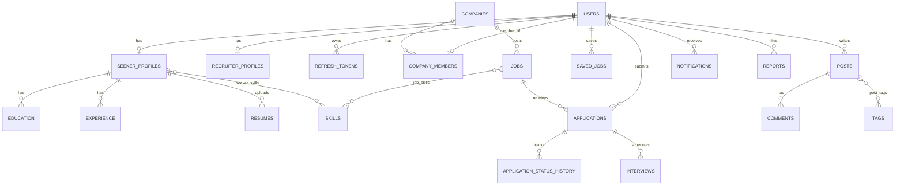

# JobForge — Database Schema Contract

> PostgreSQL 16. This file is the contract for tables, constraints, indexes, and enums. Flyway migrations implement it; they never lead it.
> Notation: `PK` primary key, `FK→t(col)` foreign key, `UQ` unique, `NN` not null, `CK` check. Types: `uuid`, `text`, `varchar(n)`, `int`, `smallint`, `bool`, `numeric`, `jsonb`, `timestamptz` (`ts`), `date`, `citext`, `tsvector`.

---

## 1. Conventions

- **IDs:** `uuid` PK, generated by the application (UUIDv4; `gen_random_uuid()` as DB default).
- **Timestamps:** `timestamptz` in UTC. Every mutable table has `created_at ts NN default now()` and `updated_at ts NN default now()` (maintained by JPA `@PreUpdate` + a DB trigger fallback).
- **Optimistic locking:** `version bigint NN default 0` on `users`, `seeker_profiles`, `companies`, `jobs`, `applications`, `posts` (mapped to `@Version`; surfaced as `version` in the API).
- **Enums:** `varchar` + `CHECK (col IN (...))` (not native PG enums) so values can be added with a simple migration. Java enums mirror §3 exactly.
- **Naming:** tables `snake_case` plural; columns `snake_case`; FKs `<entity>_id`; indexes `idx_<table>_<cols>`; unique `uq_<table>_<cols>`; checks `ck_<table>_<rule>`.
- **Money:** `salary_min/max numeric(12,0)`, `salary_currency char(3)`, `salary_period varchar(8)`.
- **Text search:** `english` configuration; `unaccent` applied at query time.
- **No business logic in triggers** beyond `updated_at` and audit-log immutability.

## 2. Schemas, Roles, Extensions, Migrations

| Schema | Owner | Contents | Flyway location (backend unless noted) |
|---|---|---|---|
| `core` | Dev 1 | Identity, profiles, companies, jobs, applications, interviews, reports, audit | `db/migration/core` |
| `community` | Dev 1 | Posts, comments, tags, likes, follows, mentions | `db/migration/community` |
| `platform` | Dev 3 | Outbox, processed events, notifications, email outbox, scheduler locks | `db/migration/platform` |
| `ai` | Dev 3 | AI requests, quota policies/overrides, usage ledger | `ai-service/src/main/resources/db/migration` |

- Each schema has its **own Flyway history table inside that schema**. Backend runs `core → community → platform` in that order.
- **FK directions allowed:** `community → core`, `platform → core`. **Forbidden:** `core → community|platform|ai`, anything → `ai`, `ai → anything`. `ai` stores `user_id` as a plain `uuid` (no FK).
- Extensions (created by `infrastructure/postgres/init/01-extensions.sql`, run as owner): `citext`, `pg_trgm`, `unaccent`.
- DB roles: `jobforge_owner` (runs migrations, owns objects), `jobforge_backend` (DML on `core`, `community`, `platform`; **only INSERT/SELECT on `core.audit_logs`**), `jobforge_ai` (DML on `ai` only). Created in `infrastructure/postgres/init/02-roles.sql`.
- Migration file naming: `V<yyyyMMddHHmm>__<schema>_<description>.sql` (timestamp versions prevent number collisions). Applied migrations are **never edited**. Destructive changes use expand/contract across two releases.

## 3. Status Enums

### 3.1 Users
- `user_role`: `JOB_SEEKER, RECRUITER, ADMIN`
- `user_status`: `PENDING_VERIFICATION, ACTIVE, SUSPENDED, DELETED`

### 3.2 Recruiters and companies
- `recruiter_approval_status`: `PENDING, APPROVED, REJECTED, SUSPENDED`
- `company_verification_status`: `PENDING, VERIFIED, REJECTED, SUSPENDED`
- `company_member_role`: `OWNER, MEMBER`
- `company_size_band`: `1_10, 11_50, 51_200, 201_500, 501_1000, 1000_PLUS`

### 3.3 Jobs
- `job_status`: `DRAFT, PUBLISHED, UNPUBLISHED, CLOSED, EXPIRED, REMOVED`
  - Transitions: `DRAFT→PUBLISHED`; `PUBLISHED→UNPUBLISHED|CLOSED|EXPIRED`; `UNPUBLISHED→PUBLISHED|CLOSED`; `CLOSED|EXPIRED→PUBLISHED` (re-open, new `expires_at`); any → `REMOVED` (ADMIN only); `REMOVED→UNPUBLISHED` (ADMIN restore). Recruiters cannot leave `REMOVED`.
- `employment_type`: `FULL_TIME, PART_TIME, CONTRACT, INTERNSHIP, FREELANCE`
- `work_mode`: `ONSITE, HYBRID, REMOTE`
- `experience_level`: `INTERN, ENTRY, MID, SENIOR, LEAD, EXECUTIVE`
- `salary_period`: `YEAR, MONTH, HOUR`

### 3.4 Seeker profile
- `profile_visibility`: `PUBLIC, RECRUITERS_ONLY, PRIVATE`
- `skill_proficiency`: `BEGINNER, INTERMEDIATE, ADVANCED, EXPERT`

### 3.5 Interviews
- `interview_type`: `PHONE, VIDEO, ONSITE`
- `interview_status`: `SCHEDULED, CONFIRMED, DECLINED, COMPLETED, CANCELLED, NO_SHOW`
- `interview_response`: `PENDING, CONFIRMED, DECLINED`

### 3.6 Applications
`application_status`: `SUBMITTED, UNDER_REVIEW, SHORTLISTED, INTERVIEW, OFFERED, HIRED, REJECTED, WITHDRAWN`

| From | Allowed next | Who |
|---|---|---|
| SUBMITTED | UNDER_REVIEW, REJECTED | Recruiter |
| UNDER_REVIEW | SHORTLISTED, REJECTED | Recruiter |
| SHORTLISTED | INTERVIEW, REJECTED | Recruiter |
| INTERVIEW | OFFERED, REJECTED | Recruiter |
| OFFERED | HIRED, REJECTED | Recruiter |
| SUBMITTED, UNDER_REVIEW, SHORTLISTED, INTERVIEW, OFFERED | WITHDRAWN | Seeker (owner) |
| HIRED, REJECTED, WITHDRAWN | — (terminal) | — |

### 3.7 Community
- `post_type`: `DISCUSSION, HIRING, REFERRAL, PROJECT, CAREER_ADVICE, TECHNICAL, EVENT`
- `post_status`: `ACTIVE, HIDDEN, REMOVED` (moderation state; user deletion uses `deleted_at`)
- `comment_status`: `ACTIVE, HIDDEN, REMOVED`
- `share_channel`: `COPY_LINK, LINKEDIN, X, EMAIL`
- `mention_source`: `POST, COMMENT`

### 3.8 Reports and moderation
- `report_target_type`: `POST, COMMENT, USER, JOB, COMPANY`
- `report_status`: `OPEN, REVIEWING, RESOLVED, DISMISSED`
- `moderation_action`: `DISMISS, HIDE_CONTENT, REMOVE_CONTENT, WARN_USER, SUSPEND_USER`
- `report_reason`: `SPAM, HARASSMENT, SCAM, INAPPROPRIATE, MISINFORMATION, DISCRIMINATION, OTHER`

### 3.9 Notifications
`notification_type`: `EMAIL_VERIFIED, APPLICATION_SUBMITTED, APPLICATION_STATUS_CHANGED, APPLICATION_RECEIVED, APPLICATION_WITHDRAWN, INTERVIEW_SCHEDULED, INTERVIEW_UPDATED, INTERVIEW_CANCELLED, INTERVIEW_RESPONSE, JOB_PUBLISHED, JOB_REMOVED, JOB_EXPIRING_SOON, RECRUITER_APPROVED, RECRUITER_REJECTED, COMPANY_VERIFIED, COMPANY_REJECTED, POST_LIKED, POST_COMMENTED, COMMENT_REPLIED, USER_MENTIONED, USER_FOLLOWED, CONTENT_MODERATED, AI_QUOTA_LOW, SYSTEM_ANNOUNCEMENT`
`notification_channel`: `IN_APP, EMAIL`

### 3.10 AI
- `ai_operation`: `JOB_GENERATION, JOB_VALIDATION, JOB_RECOMMENDATION, CANDIDATE_RECOMMENDATION, CAREER_INSIGHT`
- `ai_request_status`: `PENDING, SUCCEEDED, FAILED, REJECTED_QUOTA, REJECTED_VALIDATION`
- `ai_quota_period`: `DAILY, MONTHLY`
- `ai_ledger_state`: `RESERVED, COMMITTED, RELEASED`

### 3.11 Verification tokens
`verification_token_type`: `EMAIL_VERIFICATION, PASSWORD_RESET, ADMIN_INVITE`

## 4. Schema `core`

### 4.1 Identity
```
users
  id uuid PK
  email citext NN UQ
  password_hash varchar(100) NN
  role varchar(20) NN CK(user_role)
  status varchar(25) NN CK(user_status) default 'PENDING_VERIFICATION'
  first_name varchar(60) NN · last_name varchar(60) NN
  handle citext NN UQ  CK(handle ~ '^[a-z0-9_]{3,30}$')
  avatar_key varchar(255) NULL
  email_verified_at ts NULL · last_login_at ts NULL
  token_version int NN default 0        -- bump to invalidate all access tokens
  version bigint NN · created_at · updated_at · deleted_at ts NULL

refresh_tokens
  id uuid PK · user_id uuid NN FK→users(id) ON DELETE CASCADE
  family_id uuid NN                      -- rotation family
  token_hash char(64) NN UQ              -- SHA-256 of opaque token
  expires_at ts NN · revoked_at ts NULL · replaced_by_id uuid NULL FK→refresh_tokens(id)
  created_at ts NN · ip inet NULL · user_agent varchar(255) NULL

verification_tokens
  id uuid PK · user_id uuid NN FK→users(id) ON DELETE CASCADE
  type varchar(25) NN CK · token_hash char(64) NN UQ
  expires_at ts NN · used_at ts NULL · created_at ts NN
```

### 4.2 Seeker
```
seeker_profiles
  id uuid PK · user_id uuid NN UQ FK→users(id)
  headline varchar(120) · summary text(≤2000) · phone varchar(20)
  location_city varchar(80) · location_state varchar(80) · location_country char(2)
  current_title varchar(120) · years_experience numeric(3,1) CK(>=0 and <=60)
  expected_salary_min numeric(12,0) · expected_salary_max numeric(12,0) CK(max>=min) · expected_salary_currency char(3) · expected_salary_period varchar(8)
  notice_period_days smallint CK(0..365) · open_to_work bool NN default true
  visibility varchar(20) NN default 'RECRUITERS_ONLY' CK(profile_visibility)
  linkedin_url · github_url · portfolio_url varchar(255)   -- https only (CK ~ '^https://')
  completeness_score smallint NN default 0 CK(0..100)
  version · created_at · updated_at

skills
  id uuid PK · name citext NN UQ · slug varchar(60) NN UQ
  category varchar(40) NULL · is_verified bool NN default false · created_at

seeker_skills
  seeker_profile_id uuid NN FK→seeker_profiles(id) ON DELETE CASCADE
  skill_id uuid NN FK→skills(id)
  proficiency varchar(15) NN CK · years_experience numeric(3,1) NULL
  PK(seeker_profile_id, skill_id)

education
  id uuid PK · seeker_profile_id uuid NN FK→seeker_profiles ON DELETE CASCADE
  institution varchar(150) NN · degree varchar(100) NN · field_of_study varchar(100)
  start_date date NN · end_date date NULL · grade varchar(30) · description text(≤1000)
  CK(end_date IS NULL OR end_date >= start_date) · created_at · updated_at

experience
  id uuid PK · seeker_profile_id uuid NN FK→seeker_profiles ON DELETE CASCADE
  title varchar(120) NN · company_name varchar(150) NN · location varchar(120)
  employment_type varchar(20) CK · start_date date NN · end_date date NULL
  is_current bool NN default false · description text(≤2000)
  CK(end_date IS NULL OR end_date >= start_date) · CK(NOT (is_current AND end_date IS NOT NULL))
  created_at · updated_at

resumes
  id uuid PK · seeker_profile_id uuid NN FK→seeker_profiles(id)
  original_filename varchar(255) NN · storage_key varchar(255) NN UQ
  content_type varchar(100) NN CK(pdf|docx) · size_bytes int NN CK(<=5242880) · sha256 char(64) NN
  is_primary bool NN default false · created_at · deleted_at ts NULL
```

### 4.3 Recruiters and companies
```
recruiter_profiles
  id uuid PK · user_id uuid NN UQ FK→users(id)
  job_title varchar(100) · phone varchar(20)
  approval_status varchar(15) NN default 'PENDING' CK
  approved_by uuid NULL FK→users(id) · approved_at ts NULL · rejection_reason varchar(500)
  created_at · updated_at

companies
  id uuid PK · name varchar(150) NN · slug varchar(160) NN UQ
  description text(≤5000) · industry varchar(80) · size_band varchar(12) CK
  website_url varchar(255) · logo_key varchar(255)
  hq_city varchar(80) · hq_state varchar(80) · hq_country char(2) · founded_year smallint CK(1800..2100)
  verification_status varchar(12) NN default 'PENDING' CK
  verified_by uuid NULL FK→users(id) · verified_at ts NULL · rejection_reason varchar(500)
  created_by uuid NN FK→users(id)
  version · created_at · updated_at · deleted_at ts NULL

company_members
  company_id uuid NN FK→companies(id) · user_id uuid NN UQ FK→users(id)   -- one company per recruiter (v1)
  member_role varchar(10) NN CK · created_at
  PK(company_id, user_id)
```

### 4.4 Jobs
```
jobs
  id uuid PK
  company_id uuid NN FK→companies(id) · created_by uuid NN FK→users(id)
  title varchar(120) NN · slug varchar(160) NN UQ
  description text NN · requirements text · benefits text         -- Markdown, HTML stripped
  employment_type varchar(15) NN CK · work_mode varchar(10) NN CK · experience_level varchar(12) NN CK
  location_city varchar(80) · location_state varchar(80) · location_country char(2)
  salary_min numeric(12,0) · salary_max numeric(12,0) · salary_currency char(3) · salary_period varchar(8)
  salary_visible bool NN default true
  CK(salary_max IS NULL OR salary_min IS NULL OR salary_max >= salary_min)
  openings smallint NN default 1 CK(1..1000)
  status varchar(12) NN default 'DRAFT' CK(job_status)
  published_at ts NULL · expires_at ts NULL · closed_at ts NULL
  ai_generated bool NN default false · ai_request_id uuid NULL   -- plain uuid, no FK (ai schema is separate)
  quality_score smallint NULL CK(0..100)
  removed_by uuid NULL FK→users(id) · removed_reason varchar(500) NULL
  search_vector tsvector GENERATED ALWAYS AS (
      setweight(to_tsvector('english', coalesce(title,'')), 'A') ||
      setweight(to_tsvector('english', coalesce(description,'')), 'C')
  ) STORED
  version · created_at · updated_at · deleted_at ts NULL

job_skills
  job_id uuid NN FK→jobs(id) ON DELETE CASCADE · skill_id uuid NN FK→skills(id)
  is_required bool NN default true · PK(job_id, skill_id)

saved_jobs
  seeker_user_id uuid NN FK→users(id) · job_id uuid NN FK→jobs(id) · created_at
  PK(seeker_user_id, job_id)

job_daily_stats
  job_id uuid NN FK→jobs(id) · stat_date date NN · views int NN default 0 · applications int NN default 0
  PK(job_id, stat_date)      -- flushed from Redis counters by a scheduled job
```
`job_skills` supplements full-text search: the search module joins it for `skills` filtering (AND semantics via `GROUP BY job_id HAVING count = n`).

### 4.5 Applications and interviews
```
applications
  id uuid PK · job_id uuid NN FK→jobs(id) · seeker_user_id uuid NN FK→users(id)
  resume_id uuid NN FK→resumes(id) · cover_letter text(≤5000)
  status varchar(15) NN default 'SUBMITTED' CK(application_status)
  profile_snapshot jsonb NN           -- immutable copy of profile at submit time
  rating smallint NULL CK(1..5)
  applied_at ts NN · status_updated_at ts NN · withdrawn_at ts NULL
  version · created_at · updated_at
  UQ(job_id, seeker_user_id)          -- D-17

application_status_history
  id uuid PK · application_id uuid NN FK→applications(id) ON DELETE CASCADE
  from_status varchar(15) NULL · to_status varchar(15) NN
  changed_by uuid NN FK→users(id) · reason varchar(500) · created_at ts NN     -- append-only

application_notes
  id uuid PK · application_id uuid NN FK→applications(id) · author_user_id uuid NN FK→users(id)
  body text NN CK(length<=2000) · created_at · updated_at · deleted_at ts NULL

interviews
  id uuid PK · application_id uuid NN FK→applications(id) · scheduled_by uuid NN FK→users(id)
  type varchar(10) NN CK · scheduled_at ts NN · duration_minutes smallint NN CK(15..480)
  timezone varchar(50) NN · location_or_link varchar(500)
  status varchar(12) NN default 'SCHEDULED' CK · seeker_response varchar(10) NN default 'PENDING' CK
  seeker_response_note varchar(500) · internal_notes text · cancelled_reason varchar(500)
  created_at · updated_at
```

### 4.6 Reports and audit
```
reports
  id uuid PK · reporter_id uuid NN FK→users(id)
  target_type varchar(10) NN CK · target_id uuid NN         -- polymorphic, validated in service
  reason varchar(20) NN CK · details varchar(1000)
  status varchar(10) NN default 'OPEN' CK · created_at · updated_at
  UQ(reporter_id, target_type, target_id) WHERE status IN ('OPEN','REVIEWING')

moderation_actions
  id uuid PK · report_id uuid NULL FK→reports(id) · moderator_id uuid NN FK→users(id)
  action varchar(15) NN CK(moderation_action) · target_type varchar(10) NN · target_id uuid NN
  reason varchar(500) NN · created_at ts NN

audit_logs                                  -- append-only
  id uuid PK · occurred_at ts NN default now()
  actor_user_id uuid NULL · actor_role varchar(20) NULL · source varchar(20) NN   -- BACKEND | AI_SERVICE | SYSTEM
  action varchar(60) NN · entity_type varchar(40) NN · entity_id uuid NULL
  outcome varchar(10) NN default 'SUCCESS' CK(SUCCESS|FAILURE|DENIED)
  before_state jsonb NULL · after_state jsonb NULL · metadata jsonb NULL      -- secrets/PII redacted
  ip inet NULL · user_agent varchar(255) NULL · request_id uuid NULL
```
`audit_logs` has **no FKs** (rows must survive entity deletion). Trigger `trg_audit_immutable` raises on UPDATE/DELETE; `jobforge_backend` lacks UPDATE/DELETE privileges.

## 5. Schema `community`

```
posts
  id uuid PK · author_user_id uuid NN FK→core.users(id)
  type varchar(15) NN CK(post_type) · title varchar(150) NULL · body text NN CK(length 1..10000)
  type_metadata jsonb NN default '{}'
  status varchar(10) NN default 'ACTIVE' CK(post_status)
  like_count int NN default 0 · comment_count int NN default 0 · save_count int NN default 0 · share_count int NN default 0
  edited_at ts NULL
  search_vector tsvector GENERATED ALWAYS AS (setweight(to_tsvector('english', coalesce(title,'')),'A') || setweight(to_tsvector('english', body),'C')) STORED
  version · created_at · updated_at · deleted_at ts NULL

tags
  id uuid PK · name varchar(30) NN · slug varchar(30) NN UQ CK(slug ~ '^[a-z0-9-]{2,30}$') · created_at

post_tags    post_id FK→posts ON DELETE CASCADE · tag_id FK→tags · PK(post_id, tag_id)    -- max 5/post (service)

comments
  id uuid PK · post_id uuid NN FK→posts(id) · author_user_id uuid NN FK→core.users(id)
  parent_comment_id uuid NULL FK→comments(id)           -- depth ≤2 enforced in service
  body text NN CK(length 1..2000) · status varchar(10) NN default 'ACTIVE' CK(comment_status)
  like_count int NN default 0 · created_at · updated_at · edited_at ts NULL · deleted_at ts NULL

post_likes     post_id FK · user_id FK→core.users · created_at · PK(post_id, user_id)
comment_likes  comment_id FK · user_id FK→core.users · created_at · PK(comment_id, user_id)
post_saves     post_id FK · user_id FK→core.users · created_at · PK(post_id, user_id)
post_shares    id PK · post_id FK · user_id NULL FK→core.users · channel varchar(10) NN CK · created_at
user_follows   follower_id FK→core.users · followee_id FK→core.users · created_at · PK(follower_id, followee_id) · CK(follower_id <> followee_id)
tag_follows    user_id FK→core.users · tag_id FK→tags · created_at · PK(user_id, tag_id)
company_follows user_id FK→core.users · company_id FK→core.companies · created_at · PK(user_id, company_id)

mentions
  id uuid PK · source_type varchar(10) NN CK(mention_source) · source_id uuid NN
  mentioned_user_id uuid NN FK→core.users(id) · created_at
```
Denormalized counters are updated in the same transaction as the like/comment/save/share row and reconciled nightly.

## 6. Schema `platform`

```
outbox_events
  id uuid PK                                -- = eventId in the Kafka envelope
  aggregate_type varchar(40) NN · aggregate_id uuid NN
  event_type varchar(60) NN · event_version smallint NN default 1
  topic varchar(80) NN · payload jsonb NN · headers jsonb NN default '{}'
  created_at ts NN · published_at ts NULL · attempts int NN default 0 · last_error varchar(500)

processed_events
  consumer_group varchar(80) NN · event_id uuid NN · processed_at ts NN · PK(consumer_group, event_id)

notifications
  id uuid PK · user_id uuid NN FK→core.users(id) ON DELETE CASCADE
  type varchar(40) NN CK(notification_type) · title varchar(150) NN · body varchar(500) NN
  data jsonb NN default '{}' · dedupe_key varchar(120) NULL
  read_at ts NULL · created_at ts NN
  UQ(user_id, dedupe_key) WHERE dedupe_key IS NOT NULL

notification_preferences
  user_id uuid NN FK→core.users(id) ON DELETE CASCADE · type varchar(40) NN
  in_app_enabled bool NN default true · email_enabled bool NN default true
  PK(user_id, type)

email_outbox
  id uuid PK · user_id uuid NULL FK→core.users · to_email varchar(254) NN
  template varchar(60) NN · payload jsonb NN
  status varchar(10) NN default 'PENDING' CK(PENDING|SENT|FAILED) · attempts smallint NN default 0
  next_attempt_at ts NN · sent_at ts NULL · last_error varchar(500) · created_at

shedlock   name varchar(64) PK · lock_until ts NN · locked_at ts NN · locked_by varchar(255) NN
```

## 7. Schema `ai` (owned by ai-service)

```
ai_requests
  id uuid PK · user_id uuid NN · user_role varchar(20) NN
  operation varchar(30) NN CK(ai_operation) · status varchar(20) NN CK(ai_request_status)
  provider varchar(40) NN · model varchar(80) NN
  input jsonb NN                      -- sanitized; no secrets; PII minimized
  input_hash char(64) NN              -- SHA-256 of canonical input (dedupe/audit)
  output jsonb NULL                   -- validated output only; NULL unless SUCCEEDED
  output_schema_version varchar(30) NULL
  validation_result jsonb NULL        -- schema + business rule outcome
  quality_score smallint NULL CK(0..100)
  error_code varchar(40) NULL · error_message varchar(500) NULL
  latency_ms int NULL · tokens_input int NULL · tokens_output int NULL
  credits_charged smallint NN default 0
  idempotency_key uuid NULL · trace_id varchar(64) NULL
  created_at ts NN · completed_at ts NULL
  UQ(user_id, idempotency_key) WHERE idempotency_key IS NOT NULL

ai_quota_policies
  id uuid PK · role varchar(20) NN · period varchar(10) NN CK(ai_quota_period)
  credit_limit int NN CK(>=0) · rate_limit_per_minute int NN CK(>0) · active bool NN default true
  updated_by uuid NULL · updated_at ts NN · UQ(role, period)

ai_quota_overrides
  user_id uuid NN · period varchar(10) NN · credit_limit int NN · expires_at ts NULL
  reason varchar(500) NN · created_by uuid NN · created_at ts NN · PK(user_id, period)

ai_usage_ledger
  id uuid PK · user_id uuid NN · request_id uuid NN FK→ai_requests(id) · operation varchar(30) NN
  credits smallint NN CK(>0) · state varchar(10) NN CK(ai_ledger_state)
  period_day date NN · created_at ts NN · settled_at ts NULL
```
Source of truth for quota = `ai_usage_ledger` (sum of `COMMITTED` + non-expired `RESERVED`). Redis counters are an accelerator rebuilt from the ledger.

## 8. Relationships



## 9. Important Indexes

| Table | Index | Purpose |
|---|---|---|
| users | UQ(email), UQ(handle); `idx_users_role_status(role,status)`; trigram on `(first_name||' '||last_name)` and `handle` | Login, admin search, mentions |
| refresh_tokens | UQ(token_hash); `(user_id)`; `(family_id)`; `(expires_at)` | Rotation, cleanup |
| seeker_profiles | UQ(user_id); `(location_country, location_city)` | Candidate lookup |
| seeker_skills | `(skill_id)` | Skill-based candidate search |
| skills | UQ(name), UQ(slug); GIN trigram on `name` | Autocomplete |
| companies | UQ(slug); `(verification_status)`; GIN trigram `name` (WHERE deleted_at IS NULL) | Admin queue, search |
| jobs | **GIN(search_vector)**; **partial** `idx_jobs_published (published_at DESC, id DESC) WHERE status='PUBLISHED' AND deleted_at IS NULL`; `(company_id, status)`; `(status, expires_at)` (expiry scheduler); GIN trigram on `title`; `(work_mode, employment_type, experience_level)` partial on PUBLISHED; `(location_country, location_city)` partial on PUBLISHED; `(salary_min, salary_max)` partial on PUBLISHED | Search, recruiter lists |
| job_skills | `(skill_id, job_id)` | Skill AND filter |
| saved_jobs | `(seeker_user_id, created_at DESC)` | Saved list |
| applications | UQ(job_id, seeker_user_id); `(job_id, status)`; `(seeker_user_id, applied_at DESC)`; `(status, status_updated_at)` | Pipeline, tracking |
| application_status_history | `(application_id, created_at)` | Timeline |
| interviews | `(application_id)`; `(scheduled_at)` partial on active statuses | Calendars |
| reports | `(status, created_at)`; `(target_type, target_id)` | Moderation queue |
| audit_logs | `(entity_type, entity_id, occurred_at DESC)`; `(actor_user_id, occurred_at DESC)`; `(action, occurred_at DESC)`; BRIN(occurred_at) | Viewer queries |
| posts | GIN(search_vector); `(type, created_at DESC, id DESC)` partial `status='ACTIVE' AND deleted_at IS NULL`; `(author_user_id, created_at DESC)` | Feed, profile |
| post_tags | `(tag_id, post_id)` | Tag feed |
| comments | `(post_id, created_at, id)`; `(parent_comment_id)` | Threads |
| user_follows | `(followee_id)` | Followers |
| notifications | `(user_id, created_at DESC, id DESC)`; partial `(user_id) WHERE read_at IS NULL` | Inbox, badge |
| outbox_events | partial `(created_at) WHERE published_at IS NULL` | Relay polling |
| email_outbox | partial `(next_attempt_at) WHERE status='PENDING'` | Dispatcher |
| ai_requests | `(user_id, created_at DESC)`; `(operation, created_at)`; UQ idempotency | History, admin |
| ai_usage_ledger | `(user_id, period_day, state)`; `(request_id)` | Quota sums |

Keyset pagination always uses `(created_at DESC, id DESC)` composite indexes.

## 10. Constraints Summary

- Uniqueness: email, handle, company slug, job slug, skill name/slug, `(job_id, seeker_user_id)`, one primary resume per seeker (`UNIQUE (seeker_profile_id) WHERE is_primary AND deleted_at IS NULL`), one company per recruiter, one open report per reporter+target.
- Checks: all enums, salary ordering, date ordering, length caps, score ranges, `https`-only URLs, handle regex.
- Referential: `ON DELETE CASCADE` only for owned child rows (tokens, profile sub-records, status history, post children, notifications). Business entities use `RESTRICT` (default) because they are soft-deleted.
- State-machine rules (job and application transitions) live in service-layer domain code **and** are covered by tests; the DB does not enforce transitions (only valid values).

## 11. Soft Deletion Strategy

| Entity | Mechanism |
|---|---|
| users | `status=DELETED`, `deleted_at` set, PII anonymized (`email = 'deleted+<id>@jobforge.invalid'`, names → "Deleted User", handle → `deleted_<8hex>`), profile sub-records hard-deleted, resumes soft-deleted then purged after 30 days |
| companies, jobs, posts, comments, resumes, application_notes | `deleted_at` (+ `deleted_by` recorded in audit log) |
| applications | Never deleted (history); terminal statuses only |
| tokens, saved_jobs, likes, saves, follows, education, experience, notifications | Hard delete |
| audit_logs, status history, ledger, ai_requests | Never deleted by the app; retention job (§14) |

JPA entities use `@SQLRestriction("deleted_at IS NULL")`; admin queries use explicit native/included-deleted repository methods. Partial indexes exclude deleted rows. Moderation (`HIDDEN/REMOVED`) is separate from soft deletion.

## 12. Timestamps and Versioning

All times UTC. `created_at` immutable. `updated_at` changes on any row update. Domain-specific timestamps (`published_at`, `applied_at`, `status_updated_at`, `closed_at`, `edited_at`) are set by services, not triggers. Entities with `version` use optimistic locking and return `STALE_VERSION` on conflict.

## 13. Audit Requirements

Written via `AuditService` in the **same transaction** as the change (backend) or via Kafka topic `jobforge.audit.v1` (ai-service → backend consumer). Required actions (`audit_logs.action`):

`USER_REGISTERED, USER_LOGIN_SUCCESS, USER_LOGIN_FAILED, USER_LOGOUT, TOKEN_REUSE_DETECTED, PASSWORD_CHANGED, PASSWORD_RESET, EMAIL_VERIFIED, USER_STATUS_CHANGED, USER_ROLE_CHANGED, USER_DELETED, ADMIN_CREATED, RECRUITER_APPROVED, RECRUITER_REJECTED, COMPANY_CREATED, COMPANY_VERIFIED, COMPANY_REJECTED, COMPANY_SUSPENDED, COMPANY_MEMBER_CHANGED, JOB_CREATED, JOB_UPDATED, JOB_PUBLISHED, JOB_UNPUBLISHED, JOB_CLOSED, JOB_DELETED, JOB_REMOVED, JOB_RESTORED, APPLICATION_SUBMITTED, APPLICATION_STATUS_CHANGED, APPLICATION_WITHDRAWN, CANDIDATE_PROFILE_VIEWED, RESUME_DOWNLOADED, INTERVIEW_SCHEDULED, INTERVIEW_CANCELLED, REPORT_FILED, REPORT_RESOLVED, CONTENT_MODERATED, AI_REQUEST_COMPLETED, AI_REQUEST_REJECTED, AI_QUOTA_POLICY_CHANGED, AI_QUOTA_OVERRIDE_CHANGED, AI_REQUEST_INPUT_VIEWED, ACCESS_DENIED_SENSITIVE`

Never store passwords, tokens, API keys, or full resumes in `before_state/after_state/metadata`. Admin viewing raw AI inputs is itself audited.

## 14. Retention and Privacy

| Data | Retention |
|---|---|
| `refresh_tokens` expired/revoked | purge after 30 days |
| `verification_tokens` | purge 7 days after expiry/use |
| `notifications` | 90 days (read) / 180 days (unread) |
| `outbox_events` published | 7 days |
| `processed_events` | 14 days |
| `email_outbox` SENT | 30 days |
| `ai_requests.input` | 90 days, then nulled; metadata kept 2 years |
| `audit_logs` | 2 years online (partition by month when volume requires); then archive |
| `job_daily_stats` | indefinite |

Retention jobs run under ShedLock. Export/erase of personal data follows §11.

## 15. Seed Data

- **All environments (migration):** `skills` catalog (≈300 common skills), default `ai_quota_policies` rows (API_CONTRACT §14.6).
- **Dev profile only** (`db/seed/dev`, activated by `spring.profiles.active=dev` / `SEED_DEV_DATA=true`): admin `admin@jobforge.local`, approved recruiter + verified company, three seekers, ~200 jobs for search testing. Passwords come from `DEV_SEED_PASSWORD` env var (default documented in README, **dev only**).
- **Prod bootstrap:** first ADMIN created from `ADMIN_BOOTSTRAP_EMAIL` / `ADMIN_BOOTSTRAP_PASSWORD` once, password forced to change.

## 16. Migration Rules

1. Schema changes are contract changes: update this file first (MASTER_SPEC §13).
2. One logical change per migration; never edit an applied migration.
3. Backward-compatible (expand/contract) so the previous app version can run during deploy.
4. Every new FK column gets an index. Every new filterable column has its index justified in the PR.
5. Large backfills run as separate scheduled jobs, not inside migrations.
6. Migrations must pass `flyway validate` and run clean on an empty DB in CI (Testcontainers).
